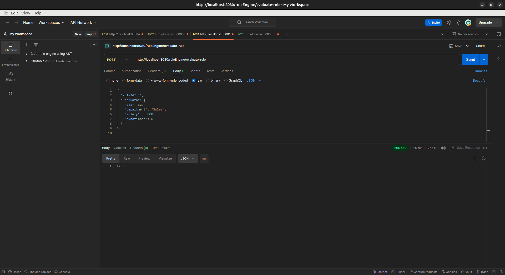

# 3TierRuleEngine-with-AST

## Overview

The 3TierRuleEngine-with-AST is a rule engine designed with a three-tier architecture using Abstract Syntax Trees (AST).
This project is intended to provide a robust and flexible framework for building and evaluating rule-based logic in a
structured and maintainable manner.

## Table of Contents

- [Prerequisites](#prerequisites)
- [Installation](#installation)
- [Running the Application](#running-the-application)
- [Design Choices](#design-choices)
- [Directory Structure](#directory-structure)
- [Contributing](#contributing)
- [License](#license)

## Prerequisites

Before you begin, ensure you have the following installed:

- Docker
- Docker Compose
- Java Development Kit (JDK) 11 or higher
- Maven

## Installation

### Clone the Repository

sh
git clone https://github.com/soam1/3TierRuleEngine-with-AST.git
cd 3TierRuleEngine-with-AST

### Setup Docker Containers

This project uses Docker for containerization. Ensure Docker is installed and running on your machine.

1. Build the Docker images:
   sh
   docker-compose build


2. Start the containers:
   sh
   docker-compose up -d

### Install Dependencies

Install the required Java dependencies using Maven:
sh
./mvnw clean install

## Running the Application

### Using Docker

Once the containers are up, you can access the application via:

- Web server: `http://localhost:8080`
- Database: `https://localhost:5432`

### Without Docker

To run the application locally without Docker:

1. Ensure the database server is running and accessible.
2. Update the `application.properties` file with your database configuration.
3. Start the application using Maven:
   sh
   ./mvnw spring-boot:run

## Table Structures

1.rules table

<!--
2.users table

-->

## Design Choices

### Three-Tier Architecture

The application is structured into three main layers:

1. **Presentation Layer**: Handles the UI/UX and user interactions.
2. **Business Logic Layer**: Contains the core logic of the rule engine, processing ASTs.
3. **Data Access Layer**: Manages data storage, retrieval, and database interactions.

### Abstract Syntax Tree (AST)

AST is used to represent the structure of rules in a tree form, allowing efficient parsing, analysis, and transformation
of rule logic.

### Containerization

Docker is used to ensure a consistent and reproducible environment, facilitating easier deployment and scalability.

## Directory Structure

```
The project structure is as follows:
3TierRuleEngine-with-AST/ 
├── .mvn/ # Maven wrapper files
├── src/ # Source code
│ ├── main/ # Main source directory
│ │ ├── java/ # Java source files
│ │ │ └── com/akashsoam/RuleEngine/ 
│ │ │ ├── RuleEngineApplication.java # Main application class
│ │ │ ├── controller/
│ │ │ │ └── RuleController.java # Controller class for handling rule requests
│ │ │ ├  ├── other controllers for web pages # Controller class for handling rule requests
│ │ │ ├── model/ # Model classes (domain objects)
│ │ │ └── service/ # Service classes (business logic)
| | | └── WebConfiguration #spring mvc web configurer
│ └── resources/ # Application resources
│ └── application.properties # Configuration properties
├── test/ # Test source files (unit and integration tests)
├── .gitignore # Git ignore file (specifies files to exclude from version control)
├── mvnw # Maven wrapper script (cross-platform)
├── mvnw.cmd # Maven wrapper script for Windows
└── pom.xml # Maven project file
└── README.md # Project README (this file)
```

Contributions are welcome! Please fork this repository and submit a pull request for review.

## Testing (Postman)





<!--
## test UI (ThymeLeaf)


-->

## Combined Rules Test Cases

### Test Cases

1. **Combine Two Simple Rules**:
    - Combines two simple rules and checks if the combined rule is valid.
2. **Combine Multiple Rules**:
    - Combines multiple rules and checks if the combined rule is valid.
3. **Combine Rules with Conflicting Conditions**:
    - Combines rules with conflicting conditions and checks if the combined rule is valid.
4. **Combine Rules with Nested Conditions**:
    - Combines rules with nested conditions and checks if the combined rule is valid.
5. **Combine Rules with Invalid Syntax**:
    - Attempts to combine rules with invalid syntax and expects a `SyntaxException`.

### Known Issues

- **Conflicting Conditions**:      
    - Combining rules with conflicting conditions may lead to unexpected behavior.
- **Invalid Syntax**:
    - Rules with invalid syntax will cause the combination process to fail.
- **Complex Nested Conditions**:
    - Combining rules with complex nested conditions may not always produce the expected results.
